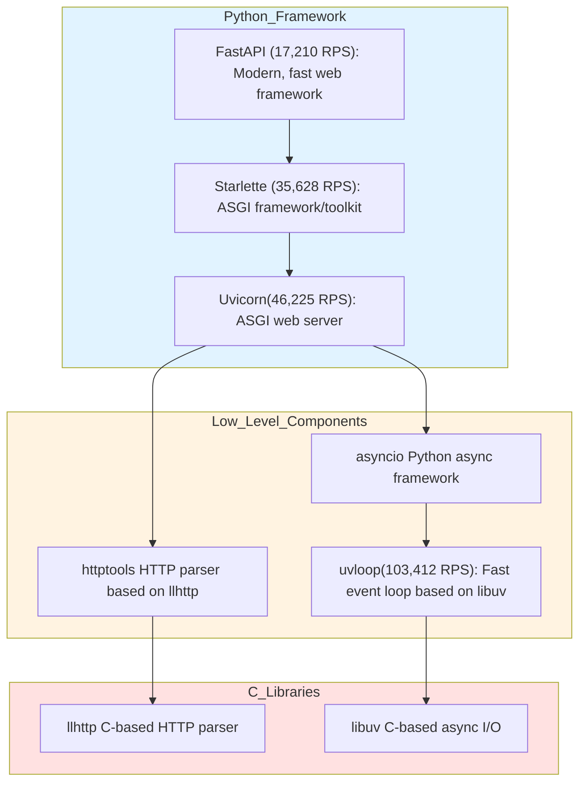
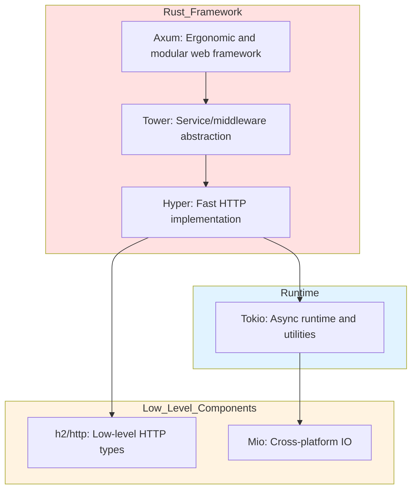

# Comparison

we compare different level of abstractions on a web servers

## axum
```rust
use axum::{
    routing::post,
    Json, Router,
};
use serde_derive::{Deserialize, Serialize}; // Changed this line
use tokio::net::TcpListener;

#[derive(Deserialize, Serialize)]
struct User {
    id: i32,
    name: String,
    email: String,
}

#[tokio::main]
async fn main() {
    // Build our application with a single POST route
    let app = Router::new().route("/user", post(create_user));
    
    // Run our app with hyper, listening globally on port 8000
    let listener = TcpListener::bind("0.0.0.0:8000").await.unwrap();
    println!("Server running on http://0.0.0.0:8000");
    axum::serve(listener, app).await.unwrap();
}

// Handler function that receives the JSON and returns the same data
async fn create_user(
    Json(user): Json<User>,
) -> Json<User> {
    Json(user)
}
```

### Result

```python
Running 10s test @ http://localhost:8000/user
  2 threads and 10 connections
  Thread Stats   Avg      Stdev     Max   +/- Stdev
    Latency   141.10us   28.93us 508.00us   71.74%
    Req/Sec    34.24k   487.51    35.74k    76.73%
  688132 requests in 10.10s, 101.72MB read
Requests/sec:  68133.61
Transfer/sec:     10.07MB
```

## uvloop + asyncio + msgspec

```python
import asyncio
from asyncio import StreamReader, StreamWriter

import uvloop
from msgspec import Struct
from msgspec.json import Decoder, Encoder

encoder = Encoder()
decoder = Decoder(User)

class User(Struct):
    id: int
    name: str
    email: str

def endpoint(data: bytes) -> bytes:
    user = decoder.decode(data)
    body = encoder.encode(user)

    # Adjust content length to reflect the actual size of the body
    content_length = len(body)
    response = (
        f"HTTP/1.1 200 OK\r\n"
        f"Content-Length: {content_length}\r\n"
        f"Content-Type: application/json\r\n\r\n"
    ).encode()

    return response + body

async def handle_client(reader: StreamReader, writer: StreamWriter):
    while True:
        request_data = await reader.read(200)
        if not request_data:
            break
        req = request_data.split(b"\r\n")
        method, host, user_agent, *_, content_length, body = req
        response = endpoint(body)  # Assuming body starts after headers

        writer.write(response)
        await writer.drain()
    writer.close()


async def main():
    port = 8000
    print(f"asyncio server started at {port}")
    server = await asyncio.start_server(handle_client, "127.0.0.1", port)

    async with server:
        await server.serve_forever()


if __name__ == "__main__":
    uvloop.run(main())
```
### Result
```python
Running 10s test @ http://localhost:8000
  2 threads and 10 connections
  Thread Stats   Avg      Stdev     Max   +/- Stdev
    Latency    94.81us   37.10us   1.26ms   74.87%
    Req/Sec    51.98k     1.85k   56.20k    76.73%
  1044402 requests in 10.10s, 117.53MB read
Requests/sec: 103412.80
Transfer/sec:     11.64MB
```

### Comment

 uvloop(libuv) + asyncio is one of the fastest async IO lib across programming languages


## uvicorn + uvloop + https + Msgspec

```python
from msgspec import Struct
from msgspec.json import Decoder, Encoder
from uvicorn._types import ASGIReceiveCallable, ASGISendCallable, Scope


class User(Struct):
    id: int
    name: str
    email: str


encoder = Encoder()
decoder = Decoder(User)


async def app(scope: Scope, receive: ASGIReceiveCallable, send: ASGISendCallable):
    """
    ASGI application that handles user data.
    """
    if scope["type"] != "http":
        return

    # Receive the HTTP body
    body: bytes = b""
    more_body = True

    while more_body:
        message = await receive()
        body += message.get("body", b"")
        more_body = message.get("more_body", False)

    user = decoder.decode(body)
    response_body = encoder.encode(user)
    content_lengh = str(len(response_body)).encode()

    # Send response headers
    await send(
        {
            "type": "http.response.start",
            "status": 200,
            "headers": [
                [b"content-type", b"application/json"],
                [b"content-length", content_lengh],
            ],
        }
    )

    # Send response body
    await send(
        {
            "type": "http.response.body",
            "body": response_body,
        }
    )
```

### Result

```python
Running 10s test @ http://localhost:8000
  2 threads and 10 connections
  Thread Stats   Avg      Stdev     Max   +/- Stdev
    Latency   213.23us   75.43us   1.76ms   67.23%
    Req/Sec    23.23k     1.95k   27.82k    72.28%
  466856 requests in 10.10s, 76.58MB read
Requests/sec:  46224.84
Transfer/sec:      7.58MB
```


## CLI Command used to run apps
```bash
python3 -m uvicorn 
--interface asgi3 
--no-access-log 
--log-level "warning" 
--http httptools server:app
```

### Starlette + Msgspec
```python
from msgspec import Struct
from msgspec.json import Decoder, Encoder
from starlette.applications import Starlette
from starlette.requests import Request
from starlette.responses import Response

encoder = Encoder()


class User(Struct):
    id: int
    name: str
    email: str


decoder = Decoder(User)


async def msgspec_user(r: Request) -> Response:
    content = await r.body()
    user = decoder.decode(content)
    u = User(id=user.id, name=user.name, email=user.email)
    return Response(content=encoder.encode(u))


app = Starlette()
app.add_route("/fast/u", msgspec_user, methods=["POST"])
```

### Result

```python
Running 10s test @ http://localhost:8000/fast/u
  2 threads and 10 connections
  Thread Stats   Avg      Stdev     Max   +/- Stdev
    Latency   277.15us   95.49us   2.40ms   67.26%
    Req/Sec    17.90k     5.13k   24.53k    45.05%
  359840 requests in 10.10s, 48.04MB read
Requests/sec:  35628.38
Transfer/sec:      4.76MB
```

### FastAPI + Pydantic
```python
from fastapi import FastAPI
from pydantic import BaseModel


class User(BaseModel):
    id: int
    name: str
    email: str


async def pydantic_user(user: User) -> User:
    u = User(id=user.id, name=user.name, email=user.email)
    return u


app = FastAPI()
app.add_api_route("/fast/u", pydantic_user, methods=["POST"])
```

### Result

```python
Running 10s test @ http://localhost:8000/fast/u
  2 threads and 10 connections
  Thread Stats   Avg      Stdev     Max   +/- Stdev
    Latency   578.80us  196.91us   3.53ms   69.46%
    Req/Sec     8.65k     0.98k    9.96k    52.50%
  172103 requests in 10.00s, 28.23MB read
Requests/sec:  17209.98
Transfer/sec:      2.82MB
```

### Starlette + Pydantic

```python
from starlette.applications import Starlette
from starlette.requests import Request
from starlette.responses import Response
from pydantic import BaseModel


class User(BaseModel):
    id: int
    name: str
    email: str


async def msgspec_user(r: Request) -> Response:
    content = await r.body()
    user = User.model_validate_json(content)
    u = User(id=user.id, name=user.name, email=user.email)
    return Response(content=User.__pydantic_serializer__.to_json(u))


app = Starlette()
app.add_route("/fast/u", msgspec_user, methods=["POST"])
```

### Result

```python
Running 10s test @ http://localhost:8000/fast/u
  2 threads and 10 connections
  Thread Stats   Avg      Stdev     Max   +/- Stdev
    Latency   309.95us  107.56us   2.10ms   70.69%
    Req/Sec    16.07k     2.38k   19.20k    54.95%
  323186 requests in 10.10s, 43.15MB read
Requests/sec:  31998.79
Transfer/sec:      4.27MB
```


Bonus

## Hardcoded asyncio

```python
import asyncio

import uvloop


def endpoint():
    response = "HTTP/1.1 200 OK\r\nContent-Length: 12\r\n\r\nHello, World"
    return response


async def handle_client(reader, writer):
    while True:
        request_data = await reader.read(1000)
        if not request_data:
            break

        response = endpoint()
        writer.write(response.encode())
        await writer.drain()

    writer.close()


async def main():
    server = await asyncio.start_server(handle_client, "127.0.0.1", 8000)

    async with server:
        await server.serve_forever()


if __name__ == "__main__":
    uvloop.run(main())
```


```python
Running 10s test @ http://localhost:8000
  2 threads and 10 connections
  Thread Stats   Avg      Stdev     Max   +/- Stdev
    Latency    84.73us   33.54us   1.05ms   68.02%
    Req/Sec    57.58k     2.75k   61.56k    61.88%
  1157219 requests in 10.10s, 56.28MB read
Requests/sec: 114584.34
Transfer/sec:      5.57MB
```


## FastAPI Architecture breakdown with RPS metrics




## Axum Architecture breakdown


