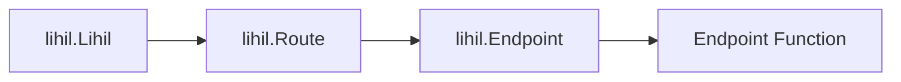

# Mini Course

we will go through some of the common concept related to web development that would help you better understand our tutorials.

## `Resource`

### Any identifiable entity that can be accessed via a URL

Don't overthink it—if you don’t like the term `resource`, think of it as an `object`.

## URI

### Uniform Resource Identifier

A string that uniquely identifies a resource. a uri can be a url, a urn, or both. a url follows the format:

> `protocol://domain/path?query#fragment`

`#fragment` is commonly used for client-side navigation, usually you do not need it writing server side application.

Example:

`https://myhost.com/users/lhl/orders?nums=3`

When you see a RESTful API with a URI like this, even without prior knowledge, you can infer that:

- It is a website hosted at `myhost.com`, using the `https` protocol.
- It is accessing a resource named `orders`, which belongs to a specific user `lhl`.
- It includes a query parameter, `nums`, with the value `3`.

`URL` (Uniform Resource Locator): A type of URI that not only identifies a resource but also provides a way to access it. URLs generally include a scheme (protocol), domain, path, query parameters, and optionally a fragment.


## ASGI

ASGI refering to `Asynchronous Server Gateway Interface`, a protocol designed by `encode`, it is often mentioned with the idea `ASGIApp`, which is an async callable with following signature.

```python
class ASGIApp(Protocol):
    async def __call__(self, scope, receive, send) -> None: ...
```

where

- `scope` is a mutable mapping, often a `dict`.
- `receive` is an async callable that has no param and return a `message`
- `message` is also a mutable mapping, often `dict`.
- `send`  is an async callable that receive a single param `message` and return `None`

Many components you see from `lihil` implementes `ASGIApp`, including

- `Lihil`
- `Route`
- `Endpoint`
- `Response`

asgi middlewares are also `ASGIApp`.


### ASGI Call Chain

`ASGIApp` are often chained together like a linked list, where each call to the chain go through every node on the chain, for example, a ordinary call stack looks like this




- `Endpoint Function`  is the function you registered with `Route.{http method}`, such as `Route.get`

- If you server lihil with an ASGI server such as uvicorn, `lihil.Lihil` will be called by uvicorn.


## Inversion of Control & Dependency Injection

### Dependency Inversion

Although the term `Inversion of Control` might sound exotic and fancy, and can be interpreted at different level of abstractions, we only talk about one of its narrow sense here,

Imagine you are writing a module that creates a user in database, you might have something like:

```python
from sqlalchemy.ext.asyncio import create_engine, AsyncEngine

class Repo:
    def __init__(self, engine: AsyncEngine):
        self.engine = engine

    async def add_user(self, user: User):
        prepared_stmt = sle.prepare_add_user(user)
        async with self.engine.connct() as conn:
            await conn.execute(prepared_stmt)

async def create_user(user: User, repo: Repository):
    await repo.add_user(user)

async def main():
    engine = create_engine(url=url)
    repo = Repo(engine)
    user = User(name="user")
    await create_user(user, repo)
```

Here you are calling `create_user` from your `main` function inside a `main.py`, when you enter `python -m myproject.main`, function `main` and `create_user` gets called.

Comparing with what would you do with lihil:

```python
user_route = Route("/users")
@user_route.post
async def create_user(user: User, repo: Repository):
    await repo.add_user(user)

lhl = Lihil(routes=[user_route])
```

Notice that, instead of you actively calling `create_user` from your function, your function is called by lihil upon request arrival.
and the dependencies of your `create_user` is managed and injected by lihil.


This is an example of `IOC` and also a major reason why a dedicated dependency injection tool `ididi` is used by lihil.

### Compare to menually constructing dependency inside endpoint function

alternatively, you might constructing dependencies yourself inside the endpoint function.
